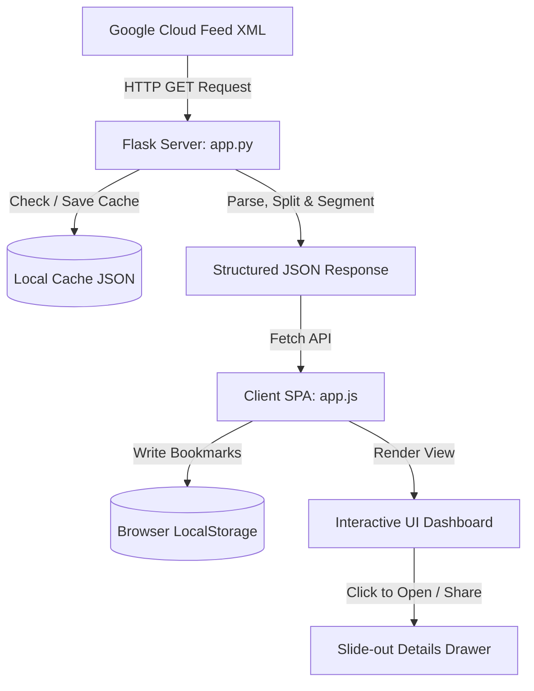

# 🌌 BigQuery Release Notes Hub

A premium, modern, and interactive single-page web application built with **Python Flask** and plain **Vanilla HTML, JavaScript, and CSS**. It fetches, parses, structures, and presents Google Cloud BigQuery release notes from their official feed.

This dashboard elevates the default Google release notes experience by parsing aggregated feeds into individual topic-focused cards, grouping them by standard types, and incorporating interactive filtering, live searching, and deep-link sharing.

---

## 🧭 Table of Contents

*   [✨ Core Features](#-core-features)
*   [🏗️ System Architecture](#️-system-architecture)
*   [📁 Project Directory Structure](#-project-directory-structure)
*   [⚙️ Installation & Running](#️-installation--running)
*   [📚 API Documentation](#-api-documentation)
*   [🎨 Design System & Visuals](#-design-system--visuals)

---

## ✨ Core Features

*   **🔍 Live Multi-Filtering & Search**:
    *   *Real-time Search*: Instantly query release updates across contents, titles, dates, or category parameters as you type.
    *   *Category Filter Pills*: Dynamic pills filter notes by `Feature`, `Fix`, `Announcement`, `Deprecated`, or `General`.
    *   *Temporal Ranges*: Narrow updates to the last 7, 30, 90, or 365 days.
    *   *Sorting Toggles*: Order notes chronologically (newest first) or reverse-chronologically (oldest first).
*   **📊 Interactive Analytics Dashboard**: Summary cards show total items and individual counts per category. Clicking any card filters the timeline stream.
*   **💾 Local Cache & Resilient Fallbacks**:
    *   Caches parsed updates locally inside `releases_cache.json` for 1 hour to prevent redundant external API roundtrips.
    *   Fails safe: automatically serves stale cache warnings if offline or if Google's endpoint times out.
*   **⭐ Personal Bookmarks**: Bookmark specific release notes. Saved state is synchronized and serialized to browser `localStorage` to persist across sessions.
*   **🔗 Deep-Link Direct Sharing**: Generates unique shareable link URLs containing note IDs (`?id=...`). Accessing the link triggers the client application to auto-open the detailed drawer for that note.
*   **📱 Premium Responsive Interface**: Sleek dark-mode dashboard styled with CSS custom variables, custom icons, glassmorphism, responsive sidebar layout, and drawer transitions.

---

## 🏗️ System Architecture

The following diagram outlines how data flows through the application:



---

## 📁 Project Directory Structure

```text
bq-releases-notes/
├── app.py                  # Flask Web Server, Caching logic & Feed Parser
├── requirements.txt        # Backend dependencies (Flask, requests)
├── templates/
│   └── index.html          # Frontend page layout
└── static/
    ├── css/
    │   └── styles.css      # Custom variables, Theme, and Layout Styling
    └── js/
        └── app.js          # SPA Logic: State, Event Bindings, Filters, Storage
```

---

## ⚙️ Installation & Running

### Prerequisites
Make sure you have **Python 3.8+** installed on your workstation.

### Step 1: Install Dependencies
Install Flask and standard packages via `pip`:
```bash
pip install -r requirements.txt
```

### Step 2: Fire Up the Server
Run the Flask server:
```bash
python app.py
```
*The dev server defaults to: `http://127.0.0.1:5000`.*

### Step 3: Open in Browser
Point your web browser of choice to:
[http://127.0.0.1:5000](http://127.0.0.1:5000)

---

## 📚 API Documentation

### `GET /`
Serves the master single-page application dashboard template.

### `GET /api/releases`
Serves the parsed release notes as structured JSON data.

*   **Query Parameters**:
    *   `refresh` (string, optional): Pass `refresh=true` to skip cache loading and query Google's feed directly.
*   **Example Response**:
    ```json
    {
      "status": "success",
      "source": "cache",
      "count": 142,
      "last_updated": "2026-06-24T17:30:00.123456",
      "releases": [
        {
          "id": "tag:google.com,2026:release_note_123_1",
          "original_entry_id": "tag:google.com,2026:release_note_123",
          "title": "June 23, 2026 - Feature",
          "date": "June 23, 2026",
          "iso_date": "2026-06-23",
          "category": "Feature",
          "html_content": "<p>BigQuery SQL now supports new JSON functions...</p>",
          "link": "https://cloud.google.com/bigquery/docs/release-notes#June_23_2026"
        }
      ]
    }
    ```

---

## 🎨 Design System & Visuals

The styling is defined entirely using custom property variables inside [styles.css](file:///C:/Users/user/agy-cli-projects/bq-releases-notes/static/css/styles.css):
*   **Dark Palette**: Uses slate and deep space dark bases (`#0b0f17`, `#111827`, `#1e293b`).
*   **Category Colors**: Dedicated CSS accents highlight category feeds:
    *   💚 Features: `#10b981`
    *   💛 Fixes: `#f59e0b`
    *   💙 Announcements: `#06b6d4`
    *   ❤️ Deprecations: `#ef4444`
*   **Micro-interactions**: Hover expansions, glowing border states, dynamic chart loading, and animated transitions on drawer slide-outs.
